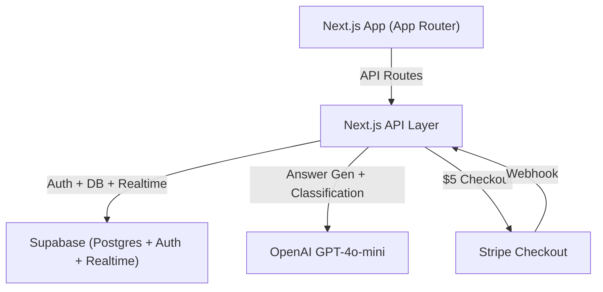

# Immigration Q&A Platform — Hackathon MVP Plan

---

## 1. MVP Scope (STRICT)

### Must-Have

- Question submission with free/paid tier selection
- Public question feed with tier badges
- AI answer generation (paid tier only, via OpenAI)
- AI complexity classification (simple/complex, background)
- Community answers on any question
- Expert answers (consultant-posted, visually distinct)
- Upvote system on all answers (one vote per user per answer)
- Stripe Checkout for $5 paid tier
- Supabase Auth (Google OAuth + email/password)
- Role selection on signup (client vs consultant)
- Consultant profile page (name, tags, rating, answered questions)
- Private consultation: simple text chat (Supabase Realtime)
- Post-session 1-5 star rating
- "Complex case" banner with CTA to start private session

### Nice-to-Have (only if time permits)

- Search/filter on question feed
- Consultant "validates" AI answer (stamp of approval)
- Markdown rendering in answers
- Pagination on feed

### Cut (do NOT build)

- Video/audio calls
- Scheduling system
- Email/push notifications
- Admin dashboard
- Moderation tools
- Analytics
- Rich text editor
- Payment for private sessions (fake it with a button for demo)

---

## 2. System Architecture




| Layer | Choice | Rationale |
| ----- | ------ | --------- |


- **Frontend**: Next.js 14 (App Router) + Tailwind CSS + shadcn/ui — fast to build, good defaults, great component library
- **Backend**: Next.js API routes (Route Handlers) — no separate server, deploy as one unit
- **Database**: Supabase (hosted Postgres) — free tier, built-in auth, realtime subscriptions for chat
- **Auth**: Supabase Auth — Google OAuth + email/password, JWT-based, row-level security
- **Payments**: Stripe Checkout — redirect-based, minimal code, webhook confirms payment
- **AI**: OpenAI `gpt-4o-mini` — cheap ($0.15/1M input tokens), fast, good enough for structured answers
- **Deployment**: Vercel — zero-config for Next.js, instant deploys

---

## 3. Data Models

### `profiles` (extends Supabase `auth.users`)

```sql
create table profiles (
  id uuid primary key references auth.users(id),
  role text not null check (role in ('client', 'consultant')),
  display_name text not null,
  bio text,
  expertise_tags text[],
  avg_rating numeric(2,1) default 0,
  rating_count int default 0,
  created_at timestamptz default now()
);
```

### `questions`

```sql
create table questions (
  id uuid primary key default gen_random_uuid(),
  user_id uuid not null references profiles(id),
  title text not null,
  body text not null,
  tier text not null check (tier in ('free', 'paid')),
  complexity text check (complexity in ('simple', 'complex')),
  ai_answer text,
  status text default 'open' check (status in ('open', 'resolved')),
  paid boolean default false,
  created_at timestamptz default now()
);
```

### `answers`

```sql
create table answers (
  id uuid primary key default gen_random_uuid(),
  question_id uuid not null references questions(id),
  user_id uuid not null references profiles(id),
  body text not null,
  type text not null check (type in ('community', 'expert')),
  upvote_count int default 0,
  created_at timestamptz default now()
);
```

### `votes`

```sql
create table votes (
  id uuid primary key default gen_random_uuid(),
  answer_id uuid not null references answers(id),
  user_id uuid not null references profiles(id),
  created_at timestamptz default now(),
  unique(answer_id, user_id)
);
```

### `sessions` (private consultations)

```sql
create table sessions (
  id uuid primary key default gen_random_uuid(),
  client_id uuid not null references profiles(id),
  consultant_id uuid not null references profiles(id),
  question_id uuid references questions(id),
  status text default 'active' check (status in ('active', 'closed')),
  created_at timestamptz default now(),
  closed_at timestamptz
);
```

### `messages`

```sql
create table messages (
  id uuid primary key default gen_random_uuid(),
  session_id uuid not null references sessions(id),
  sender_id uuid not null references profiles(id),
  body text not null,
  created_at timestamptz default now()
);
```

### `ratings`

```sql
create table ratings (
  id uuid primary key default gen_random_uuid(),
  session_id uuid unique not null references sessions(id),
  client_id uuid not null references profiles(id),
  consultant_id uuid not null references profiles(id),
  score int not null check (score between 1 and 5),
  comment text,
  created_at timestamptz default now()
);
```

### `payments`

```sql
create table payments (
  id uuid primary key default gen_random_uuid(),
  user_id uuid not null references profiles(id),
  question_id uuid references questions(id),
  amount int not null,
  stripe_session_id text,
  status text default 'pending' check (status in ('pending', 'completed', 'failed')),
  created_at timestamptz default now()
);
```

---

## 4. API Design

### Questions

- **POST** `/api/questions` — Create question (accepts `{ title, body, tier }`)
  - If `tier=paid`, return Stripe Checkout URL; AI answer + classification happen after payment webhook confirms
  - If `tier=free`, post immediately; fire classification in background
- **GET** `/api/questions` — List public questions (newest first)
- **GET** `/api/questions/[id]` — Get question with all answers

### AI (internal, triggered server-side)

- **POST** `/api/ai/answer` — Generate AI answer, store in `questions.ai_answer`
- **POST** `/api/ai/classify` — Classify complexity, store in `questions.complexity`

### Answers

- **POST** `/api/questions/[id]/answers` — Post community or expert answer
- **POST** `/api/answers/[id]/upvote` — Toggle upvote (insert or delete vote row, update `upvote_count`)

### Consultants

- **GET** `/api/consultants` — List consultants with tags + ratings
- **GET** `/api/consultants/[id]` — Profile + answered questions

### Private Sessions

- **POST** `/api/sessions` — Start session `{ consultant_id, question_id? }`
- **GET** `/api/sessions/[id]` — Get session + messages
- **POST** `/api/sessions/[id]/messages` — Send message (also broadcast via Supabase Realtime)
- **POST** `/api/sessions/[id]/close` — Close session, prompt for rating

### Ratings

- **POST** `/api/sessions/[id]/rating` — Submit `{ score, comment? }`, update consultant `avg_rating`

### Payments

- **POST** `/api/payments/checkout` — Create Stripe Checkout Session for $5
- **POST** `/api/webhooks/stripe` — Stripe webhook: mark payment complete, trigger AI answer + classification

---

## 5. AI System Design

### Feature 1: Answer Generation

**Trigger**: After Stripe webhook confirms payment (or immediately in dev/demo mode).

**Implementation**: Single OpenAI chat completion call.

```typescript
const response = await openai.chat.completions.create({
  model: "gpt-4o-mini",
  messages: [
    {
      role: "system",
      content: `You are a Canadian immigration assistant. Provide a structured answer with:
1. A direct answer (2-3 sentences)
2. Key points (bullet list)
3. Relevant immigration programs or pathways
4. A disclaimer that this is AI-generated and not legal advice.
Be specific to Canadian immigration law and IRCC processes.`
    },
    { role: "user", content: `${question.title}\n\n${question.body}` }
  ],
  max_tokens: 800,
  temperature: 0.3
});
```

**Display**: Rendered at the top of the answers section with a robot icon badge and a light blue background card. Disclaimer shown in small text below.

### Feature 2: Complexity Classification

**Trigger**: Fired asynchronously after question is created (both tiers).

**Implementation**: Single OpenAI call with constrained output.

```typescript
const response = await openai.chat.completions.create({
  model: "gpt-4o-mini",
  messages: [
    {
      role: "system",
      content: `Classify this Canadian immigration question as "simple" or "complex".
Simple: general info, timelines, document lists, eligibility basics.
Complex: multiple pathways, refusals, inadmissibility, specific case details, legal interpretation.
Respond with ONLY a JSON object: { "complexity": "simple" | "complex" }`
    },
    { role: "user", content: `${question.title}\n\n${question.body}` }
  ],
  max_tokens: 50,
  temperature: 0,
  response_format: { type: "json_object" }
});
```

**Display**: If `complexity === "complex"`, show an amber banner on the question page:

> "This looks like a complex case that may benefit from professional guidance. Consider a private consultation with a licensed consultant."
> **[Start Private Session]** button

The button links to consultant selection filtered by relevant expertise tags.

---

## 6. Step-by-Step Build Plan

### Step 1: Project Scaffold (30 min)

- `npx create-next-app@latest` with App Router + Tailwind
- Install: `@supabase/supabase-js`, `@supabase/ssr`, `shadcn/ui`, `openai`, `stripe`
- Create Supabase project, run all SQL migrations above
- Set up `.env.local` with Supabase URL/key, OpenAI key, Stripe keys
- Add Supabase client utility (`lib/supabase/client.ts`, `lib/supabase/server.ts`)

### Step 2: Auth + Role Selection (30 min)

- Supabase Auth with Google OAuth + email/password
- Post-signup role selection page (`/onboarding`): "I'm asking questions" vs "I'm a consultant"
- Create `profiles` row on role selection
- Middleware to protect routes and redirect unauthenticated users

### Step 3: Question Submission + Feed (1 hr)

- `/questions/new` — Form with title, body, tier radio (Free / $5 Paid)
- Free tier: submit directly
- Paid tier: redirect to Stripe Checkout, create question with `paid=false`
- `/questions` — Public feed, cards showing title, tier badge, answer count, complexity badge
- `/questions/[id]` — Detail page (question + answers section, empty for now)

### Step 4: Stripe Payment Flow (30 min)

- `/api/payments/checkout` — Create Checkout Session with `question_id` in metadata
- `/api/webhooks/stripe` — On `checkout.session.completed`: set `questions.paid=true`, trigger AI
- Success redirect back to question page

### Step 5: AI Integration (45 min)

- `/api/ai/answer` — Generate answer, store in `questions.ai_answer`
- `/api/ai/classify` — Classify complexity, store in `questions.complexity`
- Both called from webhook handler after payment confirms
- For free tier, only classification runs (fire-and-forget from question creation endpoint)
- Render AI answer card on question detail page
- Render complexity banner if `complex`

### Step 6: Community + Expert Answers + Upvotes (45 min)

- Answer form at bottom of question detail page
- Answer list with type badges: blue "AI" / gray "Community" / green "Expert"
- Expert type auto-assigned when answerer's role is `consultant`
- Upvote button with count, toggle behavior (insert/delete vote)
- Sort answers: Expert first, then by upvote count

### Step 7: Consultant Profiles (30 min)

- `/consultants` — Grid of consultant cards (name, tags, rating stars)
- `/consultants/[id]` — Full profile with bio, tags, rating, list of expert answers
- "Start Consultation" button on profile

### Step 8: Private Consultation Chat (45 min)

- `/sessions/[id]` — Chat UI (message list + input)
- Use Supabase Realtime to subscribe to new messages in the session
- "Close Session" button (consultant only) -> prompts client for rating
- Entry points: question page CTA, complexity banner CTA, consultant profile

### Step 9: Ratings (20 min)

- Modal/form after session close: 1-5 stars + optional comment
- On submit: insert rating, update consultant's `avg_rating` and `rating_count`
- Simple formula: `new_avg = ((old_avg * old_count) + new_score) / (old_count + 1)`

### Step 10: Polish + Demo Seed (30 min)

- Seed script: create 2 consultants, 5 questions (mix of free/paid, simple/complex), sample answers
- UI polish: loading states, empty states, error handling
- Test full flow end-to-end

---

## 7. Demo Script (2-3 minutes)

### Scene 1: Free Question (30s)

- Log in as a client
- Submit a free question: "How long does Express Entry take?"
- Show it appears in the public feed with "Free" badge
- Switch to another user, post a community answer
- Show the answer with "Community" badge

### Scene 2: Paid Question (45s)

- Submit a paid question: "I have a PhD in AI and 3 years of Canadian work experience. What are my PR options?"
- Complete $5 Stripe Checkout (use test card `4242...`)
- Return to question page — AI answer appears instantly with robot badge
- Show complexity classified as "simple"
- Switch to consultant account, post an expert answer
- Upvote both answers, show counts update

### Scene 3: Complex Case (45s)

- Submit a paid question: "I was refused a visitor visa twice, have a DUI from 2019, and want to apply for a work permit through my spouse who is a PR"
- After payment, AI answer generates
- Complexity classified as "complex" — amber banner appears:
*"This looks like a complex case. Consider a private consultation."*
- Click "Start Private Session"

### Scene 4: Private Consultation + Rating (30s)

- Show real-time chat between client and consultant
- Consultant closes the session
- Client rates 5 stars
- Navigate to consultant profile — show updated rating and answered questions

---

## 8. Two-Dev Workload Split

The goal is **zero merge conflicts** by giving each dev clear file ownership, then integrating at well-defined seams.

### Phase 0: Together (30 min) — BEFORE splitting

Both devs pair on this (or screen-share). Do NOT split until this is done.

- Run `create-next-app`, install all deps, init shadcn/ui
- Create the Supabase project and run ALL SQL migrations (all 8 tables)
- Set up `lib/supabase/client.ts`, `lib/supabase/server.ts`, `lib/openai.ts`, `lib/stripe.ts`
- Set up `.env.local` (both devs copy the same keys)
- Push to a shared Git repo on `main`
- Create shared TypeScript types in `lib/types.ts` (Question, Answer, Profile, Session, etc.)
- Set up `app/layout.tsx` with nav shell (logo, login/logout, link placeholders)

After this, each dev creates their own branch and works independently.

---

### Dev 1: "Questions + AI + Payments" (the core product pipeline)

**Owns these files:**

```
app/page.tsx                          (landing / question feed)
app/questions/new/page.tsx            (submit form)
app/questions/[id]/page.tsx           (question detail — layout only)
app/api/questions/route.ts            (POST, GET)
app/api/questions/[id]/route.ts       (GET)
app/api/ai/answer/route.ts
app/api/ai/classify/route.ts
app/api/payments/checkout/route.ts
app/api/webhooks/stripe/route.ts
components/question-card.tsx
components/ai-answer.tsx
components/complexity-banner.tsx
lib/stripe.ts
lib/openai.ts
```

**Build order:**

1. Question form (`/questions/new`) + POST `/api/questions` — free tier posts directly, paid tier returns Stripe URL
2. Question feed (`/page.tsx`) + GET `/api/questions` — list cards with tier/complexity badges
3. Question detail page (`/questions/[id]`) + GET `/api/questions/[id]` — show question + AI answer slot + placeholder `<AnswerSection />` (imports Dev 2's component)
4. Stripe Checkout flow + webhook — payment creates, webhook marks paid + triggers AI
5. AI answer generation + complexity classification — OpenAI calls, store results, render `<AiAnswer />` and `<ComplexityBanner />`
6. Wire it all together: paid flow end-to-end (submit -> pay -> AI answer appears -> complexity banner if complex)

**Estimated time:** ~2.5 hrs

---

### Dev 2: "Answers + Consultants + Chat + Ratings" (the people layer)

**Owns these files:**

```
app/onboarding/page.tsx               (role selection)
app/consultants/page.tsx              (consultant list)
app/consultants/[id]/page.tsx         (consultant profile)
app/sessions/[id]/page.tsx            (private chat)
app/api/questions/[id]/answers/route.ts
app/api/answers/[id]/upvote/route.ts
app/api/consultants/route.ts
app/api/consultants/[id]/route.ts
app/api/sessions/route.ts
app/api/sessions/[id]/route.ts
app/api/sessions/[id]/messages/route.ts
app/api/sessions/[id]/close/route.ts
app/api/sessions/[id]/rating/route.ts
components/answer-section.tsx         (full answer section: list + form)
components/answer-card.tsx
components/consultant-card.tsx
components/chat-message.tsx
components/rating-form.tsx
middleware.ts                         (auth middleware)
```

**Build order:**

1. Auth + middleware + onboarding page — Supabase Auth setup, role selection, `profiles` insert
2. Answer section component (`<AnswerSection questionId={id} />`) — answer form, answer list with type badges, upvote toggle
3. Consultant list + profile pages — grid of cards, detail page with bio/tags/rating/answered questions
4. Private chat — session creation, Supabase Realtime subscription, message list + input, close button
5. Ratings — post-close modal, 1-5 stars, update consultant avg_rating
6. Wire "Start Private Session" buttons into answer section and consultant profiles

**Estimated time:** ~2.5 hrs

---

### Integration Contract (the seam between Dev 1 and Dev 2)

The only shared touchpoint is the question detail page (`/questions/[id]/page.tsx`).

**Dev 1** owns the page and renders:

```tsx
import { AnswerSection } from '@/components/answer-section';
import { AiAnswer } from '@/components/ai-answer';
import { ComplexityBanner } from '@/components/complexity-banner';

// Dev 1 builds the question display + AI answer + complexity banner
// Dev 2's AnswerSection is imported as a black-box component:
<AiAnswer content={question.ai_answer} />
<ComplexityBanner complexity={question.complexity} questionId={question.id} />
<AnswerSection questionId={question.id} />
```

**Dev 2** exports `<AnswerSection questionId={string} />` that handles everything: fetching answers, posting new ones, upvotes. Dev 1 just drops it in.

**Agree on this interface before splitting.** Dev 2 can start by exporting a stub:

```tsx
export function AnswerSection({ questionId }: { questionId: string }) {
  return <div>Answers for {questionId} — coming soon</div>;
}
```

---

### Merge Strategy

```mermaid
gitgraph
  commit id: "Phase 0: scaffold"
  branch dev1_questions_ai_payments
  branch dev2_answers_consultants_chat
  checkout dev1_questions_ai_payments
  commit id: "Question form + feed"
  commit id: "Stripe + webhook"
  commit id: "AI integration"
  checkout dev2_answers_consultants_chat
  commit id: "Auth + onboarding"
  commit id: "Answers + upvotes"
  commit id: "Consultants + chat"
  commit id: "Ratings"
  checkout main
  merge dev1_questions_ai_payments id: "Merge Dev 1"
  merge dev2_answers_consultants_chat id: "Merge Dev 2"
  commit id: "Phase 3: polish + seed"
```

- Each dev works on their own branch (`dev1/questions-ai-payments`, `dev2/answers-consultants-chat`)
- Merge Dev 1 first (owns the page layout), then Dev 2 (drops components in)
- If merging causes issues, resolve on Dev 2's branch before merging to main
- Final polish phase: both devs on `main`, seed data, test full flow

---

### Phase 3: Together Again (30 min) — Polish + Demo

- Write seed script together (2 consultants, 5 questions, sample answers)
- Test all 4 demo scenes end-to-end
- Fix any integration bugs
- Add loading/empty states where missing
- Deploy to Vercel

---

### Communication Checkpoints

- **After Phase 0**: Confirm `lib/types.ts` and `<AnswerSection>` interface
- **Halfway (~1 hr in)**: Quick sync — "my stuff works in isolation, any blockers?"
- **Before merge**: Each dev demos their half independently
- **After merge**: Run through demo script together

---

## 9. Risks + Simplifications

### Risks

- **Stripe webhook in dev**: Use `stripe listen --forward-to localhost:3000/api/webhooks/stripe` for local testing. For demo, can bypass with a "simulate payment" button if webhook is flaky.
- **OpenAI latency**: `gpt-4o-mini` is fast (~1-2s) but could spike. Mitigate: show a loading skeleton for AI answer, generate async.
- **Supabase Realtime**: Occasionally drops connections. Mitigate: add a "Send" button that also does an optimistic UI update.
- **Auth edge cases**: Role-based access bugs. Mitigate: keep RLS policies simple, test both roles.
- **Demo reliability**: Network-dependent services (Stripe, OpenAI, Supabase). Mitigate: seed realistic data, have fallback screenshots.

### If Running Out of Time (cut in this order)

1. **Cut private chat** — Replace with a static "Session started" page + fake messages
2. **Cut Stripe integration** — Hard-code `paid=true` on form submit, skip checkout
3. **Cut ratings** — Show a static "4.8 stars" on consultant profiles
4. **Cut upvotes** — Show static counts
5. **Cut complexity classification** — Hard-code one question as "complex" in seed data

### Simplifications Already Made

- No payment for private sessions (just a button click)
- No real consultant verification (role is self-selected)
- No moderation or spam protection
- No email notifications
- AI disclaimer covers legal liability for demo purposes
- Rating is a simple running average (no weighted/Bayesian scoring)

---

## File Structure

```
/app
  /layout.tsx
  /page.tsx                     (landing / question feed)
  /onboarding/page.tsx          (role selection)
  /questions
    /new/page.tsx               (submit question)
    /[id]/page.tsx              (question detail + answers)
  /consultants
    /page.tsx                   (consultant list)
    /[id]/page.tsx              (consultant profile)
  /sessions
    /[id]/page.tsx              (private chat)
  /api
    /questions/route.ts         (POST, GET)
    /questions/[id]/route.ts    (GET)
    /questions/[id]/answers/route.ts (POST)
    /answers/[id]/upvote/route.ts    (POST)
    /ai/answer/route.ts         (POST)
    /ai/classify/route.ts       (POST)
    /consultants/route.ts       (GET)
    /consultants/[id]/route.ts  (GET)
    /sessions/route.ts          (POST)
    /sessions/[id]/route.ts     (GET)
    /sessions/[id]/messages/route.ts (POST)
    /sessions/[id]/close/route.ts    (POST)
    /sessions/[id]/rating/route.ts   (POST)
    /payments/checkout/route.ts      (POST)
    /webhooks/stripe/route.ts        (POST)
/lib
  /supabase/client.ts
  /supabase/server.ts
  /openai.ts
  /stripe.ts
/components
  /ui/                          (shadcn components)
  /question-card.tsx
  /answer-card.tsx
  /ai-answer.tsx
  /complexity-banner.tsx
  /consultant-card.tsx
  /chat-message.tsx
  /rating-form.tsx
```

